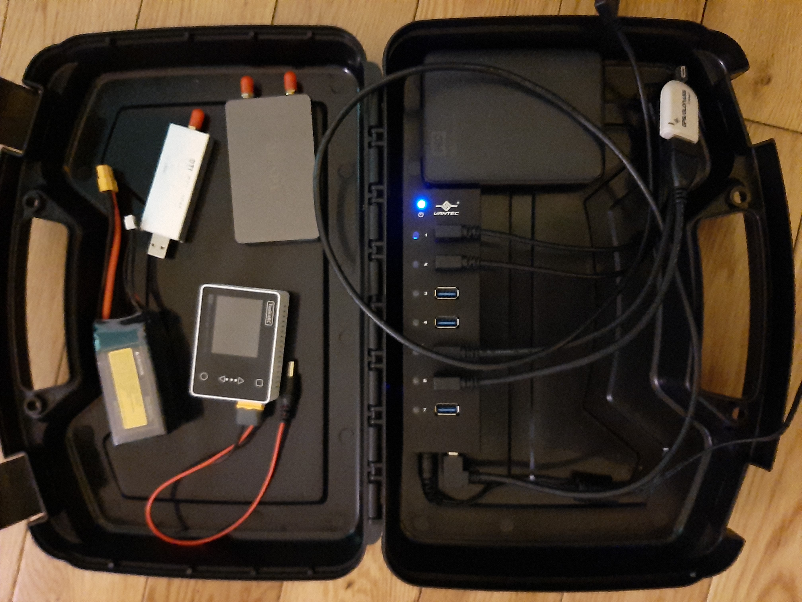

This repo contains a MQTT controlled SDR radio client.
Instead of using a GUI or the command line to communicate
with your SDR radio, commands and status messages are sent over MQTT.

The radio client program itself is quite simple.  It
is a Python program that uses the SoapySDR library to capture the SDR radio
stream and write the result to a file as either
a wav sound file or a raw file.

A TCP/network server is also provided for listening to
the stream.  In addition a peak dBFS reading is sent to the 
MQTT queue.  This way the radio levels can
be checked and the gain of the radio adjusted
using the radio's MQTT control (topic) channel. 

The radio client supports the following commands
over the control channel:

```
i          # probe detailed radio device information
a true     # enable or disable automatic gain control
g xxx.x    # set gain of the radio
r xxxxx    # set the sampling rate of the radio in Hertz
f xxxxx    # set the frequency of the radio in Hertz

p true     # pause or unpause the stream
k true     # kill the current stream and start a new one
K true     # kill the application itself with an exit code of 1

(see https://github.com/pothosware/SoapyRTLSDR/blob/master/Settings.cpp)
ds [0|1|2] # set IQ or direct sampling mode
iq true    # enable IQ signal swap
bt true    # enable bias tee 
da true    # enable digital agc
ot true    # enable offset tune
```

If you want to listen to the captured
stream or to see a waterfall of it, the assumption
is that you would use a third party radio client to
read the output file as it is writing - either from 
the computer hosting the client or over a network 
file server.

That said the intent of the radio client is for unattended
operation, with the MQTT queue serving to both
send commands to it and for receiving status reports from
it.  The name of the radio client application is "mqsoapy".


```
$ python3 mqsoapy.py --help
usage: mqsoapy.py [-h] [--broker BROKER] [--broker-port BROKER_PORT]
                  [--broker-keepalive BROKER_KEEPALIVE] [--topic TOPIC]
                  [--pps-topic PPS_TOPIC] [--nobroker]
                  [--refresh-pps REFRESH_PPS] [--driver DRIVER]
                  [--packet-size PACKET_SIZE] [--freq FREQ] [--rate RATE]
                  [--gain GAIN] [--agc] [--direct-samp DIRECT_SAMP]
                  [--iq-swap] [--biastee] [--digital-agc] [--offset-tune]
                  [--output OUTPUT] [--nowave] [--pause]
                  [--restart-seconds RESTART_SECONDS] [--refresh REFRESH]
                  [--meter] [--dumb] [--host HOST] [--port PORT] [--rtltcp]
                  [--noserver] [--freeze] [--wrap]

optional arguments:
  -h, --help            show this help message and exit
  --broker BROKER       broker host (default: 0.0.0.0)
  --broker-port BROKER_PORT
                        broker port (default: 1883)
  --broker-keepalive BROKER_KEEPALIVE
                        broker keepalive seconds (default: 60)
  --topic TOPIC         mqtt topic for command (default: f/tx)
  --pps-topic PPS_TOPIC
                        mqtt topic for gps pps time (default: pps)
  --nobroker            disable mqtt broker (default: False)
  --refresh-pps REFRESH_PPS
                        pps refresh in seconds (default: 10)
  --driver DRIVER       name of driver (default: None)
  --packet-size PACKET_SIZE
                        packet size (default: 1024)
  --freq FREQ           center frequency in hertz (default: None)
  --rate RATE           sample rate in hertz (default: None)
  --gain GAIN           front end gain in dB (default: None)
  --agc                 enable AGC (default: False)
  --direct-samp DIRECT_SAMP
                        1 or i=I, 2 or q=Q channel (default: None)
  --iq-swap             swap IQ signals (default: False)
  --biastee             enable bias tee (default: False)
  --digital-agc         enable digital AGC (default: False)
  --offset-tune         enable offset tune (default: False)
  --output OUTPUT       write CF32 samples to file (default: out)
  --nowave              disable WAV header (default: False)
  --pause               pause output (default: False)
  --restart-seconds RESTART_SECONDS
                        restart delay in seconds (default: 10)
  --refresh REFRESH     peak meter refresh in seconds (default: 5)
  --meter               enable console peak meter (default: False)
  --dumb                enable dumb terminal console (default: False)
  --host HOST           CF32 tcp server host address (default: 0.0.0.0)
  --port PORT           CF32 tcp server port address (default: 1234)
  --rtltcp              enable CU8 rtltcp server mode (default: False)
  --noserver            disable tcp server (default: False)
  --freeze              freeze tcp server settings (default: False)
  --wrap                wrap 0 Hz to 100 MHz (default: False)
```


In addition the radio supports the reception of GPS PPS signals
over a MQTT topic subscription.   Anytime a message is received
over the PPS topic the radio client writes out an Audacity formatted
label to a text file with the same name as the sound file.
In this way the sound file can be kept in sync with GPS time.
The name of the application that publishes the PPS signal
to the MQTT is "mqpps".  The program listens to the gpsd socket
on your computer and publishes the GPS time over the given
MQTT topic whenever a full "TPV" message is received from
the satellite(s).


```
$ python3 mqpps.py --help
usage: mqpps.py [-h] [--broker BROKER] [--port PORT] [--keepalive KEEPALIVE]
                [--pps-topic PPS_TOPIC]

optional arguments:
  -h, --help            show this help message and exit
  --broker BROKER       broker host (default: 127.0.0.1)
  --port PORT           broker port (default: 1883)
  --keepalive KEEPALIVE
                        broker keep alive (default: 60)
  --pps-topic PPS_TOPIC
                        PPS topic (default: pps)
```


To communicate over the MQTT queue and send control commands
to radio client as well as receive status messages from the radio,
an application named "mqclient" is provided.  Any
line typed in the application gets sent over the MQTT topic that
serves as the radio client's control channel.


```
$ python3 mqclient.py --help
usage: mqclient.py [-h] [--broker BROKER] [--port PORT]
                   [--keepalive KEEPALIVE] [--topic TOPIC]

optional arguments:
  -h, --help            show this help message and exit
  --broker BROKER       broker host (default: 127.0.0.1)
  --port PORT           broker port (default: 1883)
  --keepalive KEEPALIVE
                        broker keep alive (default: 60)
  --topic TOPIC         command topic (default: f/tx)
```


But what if you do not have a network?  What if you are
outside without a LAN gathering radio signals?  For this, another
application is provided called "mqproxy".  This application proxies
Bluetooth signals from your phone, say, to and from 
the MQTT queue, thereby letting you control the radio client 
from your phone.  The BLE-MQTT proxy app uses the "BLE UART" device standard
to do this.
Any line sent over a "BLE UART" bluetooth connection is relayed to the
MQTT radio control topic.  And all messages received over the 
MQTT queue are sent back.  There are two phone apps I know of
that support communication over the "BLE UART" standard.  They are
nRF UART and Bluefruit LE Connect.


```
$ python3 mqblue.py --help
usage: mqblue.py [-h] [--broker BROKER] [--port PORT] [--keepalive KEEPALIVE]
                 [--topic TOPIC]

optional arguments:
  -h, --help            show this help message and exit
  --broker BROKER       broker host (default: 127.0.0.1)
  --port PORT           broker port (default: 1883)
  --keepalive KEEPALIVE
                        broker keep alive (default: 60)
  --topic TOPIC         command topic (default: f/tx)
```


Lastly to install the suite of programs provided here the repo
includes three ansible playbook for installing the suite on
the Raspberry Pi. 

